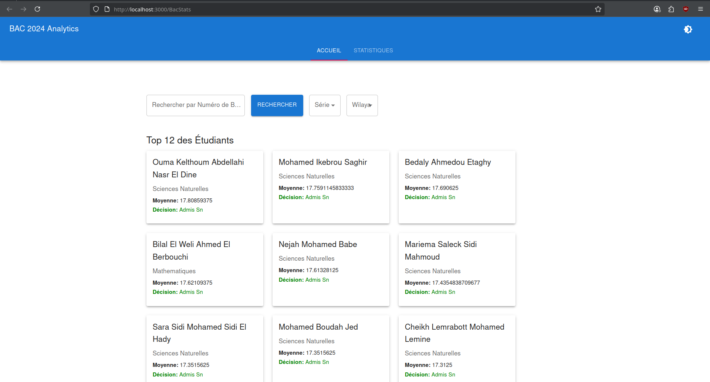
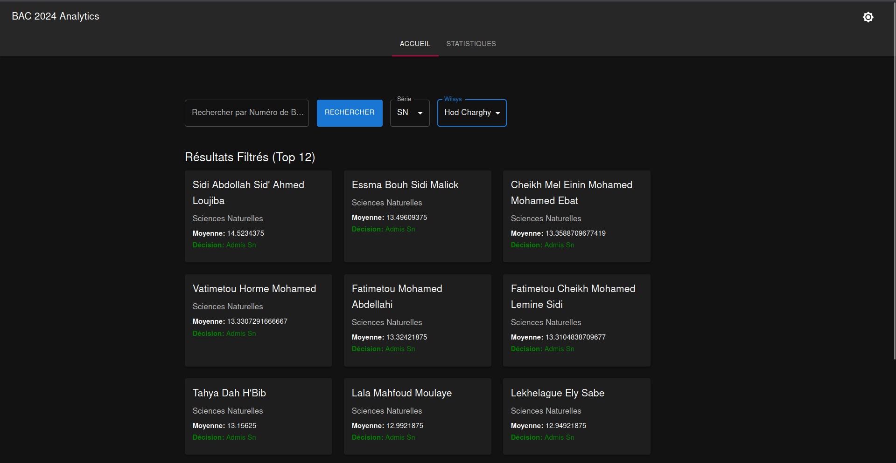
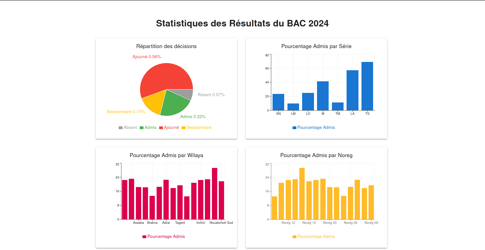

# Application d'Analyse du BAC 2024

Une application web React moderne pour visualiser et analyser les résultats de la session du BAC 2024 avec une interface intuitive et des fonctionnalités d'analyse avancées.

## 🚀 Fonctionnalités

- **📊 Tableau de Bord Interactif** : Navigation fluide avec interface à onglets
- **🌙 Mode Sombre/Clair** : Basculement entre thèmes pour une meilleure expérience utilisateur
- **📈 Visualisation des Données** : Graphiques et statistiques des résultats du BAC
- **🔍 Recherche Avancée** : Recherche rapide de résultats spécifiques
- **📱 Design Réactif** : Interface optimisée pour tous les appareils
- **⚡ Indicateurs de Chargement** : Retour visuel pendant le traitement des données

## 🛠️ Technologies Utilisées

### Frontend
- **React.js** - Framework JavaScript moderne
- **Material-UI** (@mui/material) - Composants UI élégants
- **React Hooks** - Gestion d'état moderne
- **Context API** - Gestion d'état globale

### Données
- **JSON** - Format de données structuré
- **Python** - Script de conversion des données

## 📁 Structure du Projet

```
bac-analytics-app/
├── public/
│   ├── results.json          # Données JSON des résultats du BAC
│   └── ...                   # Ressources statiques
├── src/
│   ├── App.js               # Composant principal
│   ├── index.js             # Point d'entrée
│   └── components/
│       ├── Home.js          # Interface d'accueil/recherche
│       └── Statistics.js    # Analyses statistiques
├── .github/workflows/
│   └── deploy.yml           # CI/CD GitHub Pages
├── convert_to_json.py       # Script de conversion des données
├── screenshots/             # Captures d'écran
└── package.json            # Configuration du projet
```

## 🚀 Installation et Développement

### Prérequis
- Node.js (version 16+)
- npm ou yarn

### Installation
```bash
# Cloner le repository
git clone https://github.com/Zeini-23025/BacStats.git
cd BacStats/bac-analytics-app

# Installer les dépendances
npm install

# Lancer en mode développement
npm start
```

L'application sera accessible sur `http://localhost:3000`

## 📦 Scripts Disponibles

```bash
npm start      # Mode développement
npm run build  # Build de production
npm test       # Lancer les tests
npm run deploy # Déployer sur GitHub Pages
```

## 🌐 Déploiement

### Déploiement Automatique
L'application se déploie automatiquement sur GitHub Pages à chaque push sur `main`.

### URL de Production
🔗 **[https://zeini-23025.github.io/BacStats](https://zeini-23025.github.io/BacStats)**

## 📊 Préparation des Données

Le script `convert_to_json.py` convertit les données CSV brutes du BAC en format JSON optimisé pour l'application React.

## 📸 Screenshots

### 🖥️ **Home page**

*Interface desktop avec graphiques complets*

### 📱 **Darck mode**

*Interface mobile optimisée avec cartes*

### 📊 **Statistiques page**

*Analyse détaillée par série et région*

## 👨‍💻 Auteur

**Zeini Cheikh**  
[](https://github.com/Zeini-23025)


---

⭐ **N'hésitez pas à donner une étoile si ce projet vous a aidé !**